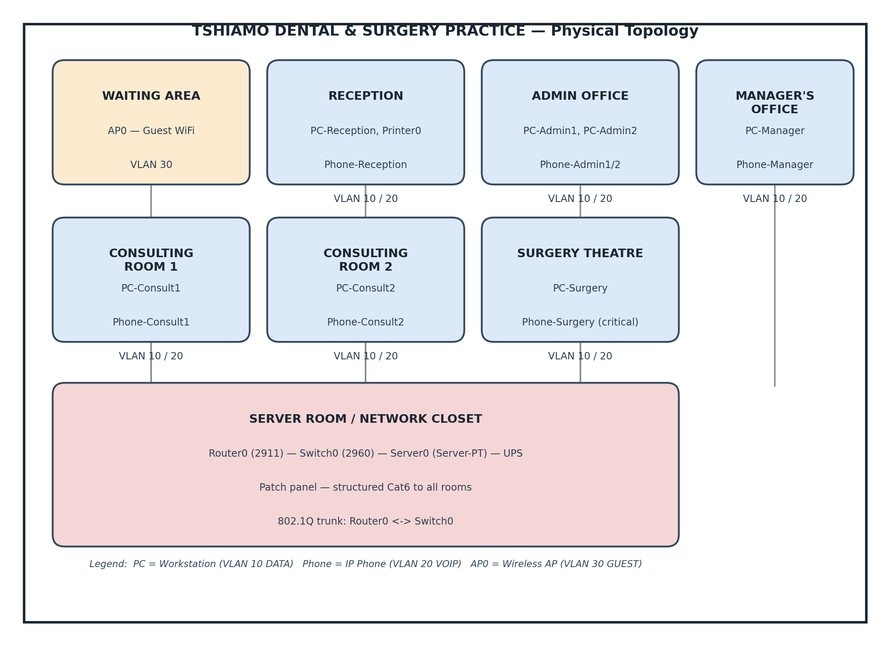

# 2. Physical Topology

The diagram below shows the facility layout, device placement, and how each room connects back to the server room / network closet.

*Figure 1 — Physical topology of Tshiamo Dental & Surgery Practice*

## 2.1 Device Inventory

| Device | Model | Qty | Location | Purpose |
|--------|-------|-----|----------|---------|
| Router0 | Cisco 2911 | 1 | Server Room | Edge router — WAN connectivity, inter-VLAN routing |
| ISP1 Router | Cisco 2911 | 1 | External (simulated) | Primary Internet Service Provider |
| ISP2 Router | Cisco 2911 | 1 | External (simulated) | Secondary Internet Service Provider |
| Switch0 | Cisco 2960-24TT | 1 | Server Room | Core access switch — VLAN segmentation |
| Server0 | Server-PT | 1 | Server Room | Practice management, file storage, DHCP |
| Printer0 | Printer-PT | 1 | Reception | Network printer for admin documents |
| AP0 | Access Point-PT | 1 | Reception/Waiting | Wireless access for guests/contractors |
| PC-PT | PC-PT | 7 | Various | End-user workstations |
| IP Phone | 7960 | 7 | Various | Voice over IP telephony |

## 2.2 Cabling Infrastructure

- Standard: Cat6 UTP Ethernet cabling throughout the facility
- Drop policy: minimum 2 drops per workstation (1 for PC, 1 for Phone)
- Trunk: Gigabit Ethernet trunk between Router0 and Switch0
- Server room: patch panel with structured cabling to all areas
- Wireless: AP0 positioned centrally for optimal coverage of waiting and reception areas
