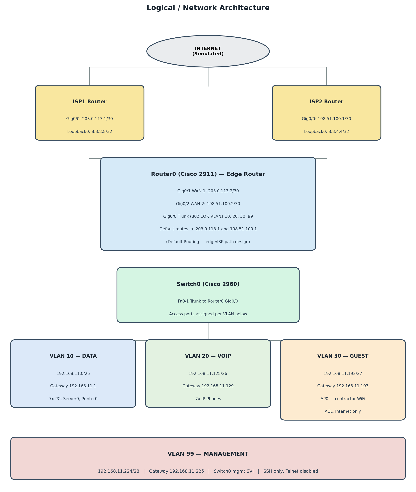

# 3. Logical Topology

The diagram below shows the logical network architecture: dual-ISP edge connectivity, the router-on-a-stick VLAN design, and the four VLANs used to segment traffic.



*Figure 2 — Logical network architecture and VLAN design*

## 3.1 VLAN Design

| VLAN | Name | Purpose | Subnet |
|------|------|---------|--------|
| 10 | DATA | Staff workstations, servers, printers | 192.168.11.0/25 (126 hosts) |
| 20 | VOIP | IP telephony and voice services | 192.168.11.128/26 (62 hosts) |
| 30 | GUEST | Guest & contractor wireless access | 192.168.11.192/27 (30 hosts) |
| 99 | MGMT | Network device management | 192.168.11.224/28 (14 hosts) |

## 3.2 Inter-VLAN Routing (Router-on-a-Stick)

| Subinterface | VLAN | IP Address | Description |
|---------------|------|------------|--------------|
| Gig0/0.10 | 10 | 192.168.11.1/25 | DATA gateway |
| Gig0/0.20 | 20 | 192.168.11.129/26 | VOIP gateway |
| Gig0/0.30 | 30 | 192.168.11.193/27 | GUEST gateway |
| Gig0/0.99 | 99 | 192.168.11.225/28 | MGMT gateway |

**Design justification:** router-on-a-stick is selected for this foundation-level design because it clearly demonstrates VLAN segmentation and inter-VLAN routing, is cost-effective for a small practice (single router, single switch), simplifies troubleshooting and documentation, and provides sufficient bandwidth for a 15–20 device network.

## 3.3 Default Routing — Edge/ISP Path Design

**Assigned challenge:** Default Routing (edge/ISP path design).

**Implementation:** Router0 maintains two default routes at the network edge, one toward each ISP:

```
ip route 0.0.0.0 0.0.0.0 203.0.113.1   ! Primary ISP
ip route 0.0.0.0 0.0.0.0 198.51.100.1  ! Secondary ISP
```

**Why this is appropriate:**
- Redundancy: if ISP1 fails, traffic can be redirected via ISP2 without redesigning the routing table
- Simplicity: default routing avoids the overhead of a dynamic routing protocol, appropriate at Foundation difficulty
- Healthcare requirement: dental practices rely on cloud-based practice management and appointment systems, so edge-level dual-ISP connectivity supports availability

**Verification method:**
- `show ip route` — confirms the default routes are installed in the routing table
- `traceroute 8.8.8.8` / `traceroute 8.8.4.4` — verifies the path taken to each simulated ISP
- Disconnect one ISP interface and confirm the router still forwards via the remaining route

**Failover behaviour:** under normal operation, Cisco IOS installs both default routes (equal administrative distance) and load-shares traffic across both ISP links. If one ISP link fails, IOS automatically removes that route once the next-hop becomes unreachable, so all traffic shifts to the surviving link without manual intervention  — this is exactly what the disconnect-test above demonstrates.

## 3.4 Security Architecture

**VLAN isolation:**
- VoIP traffic (VLAN 20) is separated from data traffic (VLAN 10) at the switch access-port and VLAN level
- No inter-VLAN routing between VLAN 30 (GUEST) and the internal VLANs (10, 20, 99)

**Access Control List — GUEST_RESTRICT** (applied to Gig0/0.30 inbound):

```
ip access-list extended GUEST_RESTRICT
 deny ip 192.168.11.192 0.0.0.31 192.168.11.0 0.0.0.127   ! Block DATA
 deny ip 192.168.11.192 0.0.0.31 192.168.11.128 0.0.0.63  ! Block VOIP
 deny ip 192.168.11.192 0.0.0.31 192.168.11.224 0.0.0.15  ! Block MGMT
 permit ip 192.168.11.192 0.0.0.31 any                    ! Allow Internet
```

**Design justification:** this ACL ensures contractors and guests can only reach the Internet, protecting patient data (POPIA compliance) and internal voice systems.

**Management security:**
- Switch0 management interface (VLAN 99) sits on a dedicated subnet
- SSH access enabled; Telnet disabled
- No direct management access from VLAN 30 (GUEST)
